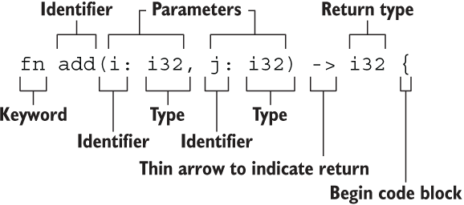

## 函数要点



函数名和变量名使用蛇形命名法(snake case)，例如 `fn add_two() {}`

函数的位置可以随便放，Rust 不关心我们在哪里定义了函数，只要有定义即可

每个函数参数都需要标注类型

## 永不返回的发散函数 !

当用 `!` 作函数返回类型的时候，表示该函数永不返回(diverging functions)，特别的，这种语法往往用做会导致程序崩溃的函数：

```rust
fn dead_end() -> ! {
  panic!("你已经到了穷途末路，崩溃吧！");
}
```
